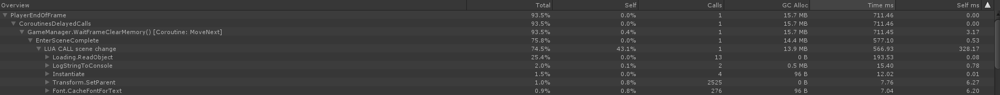
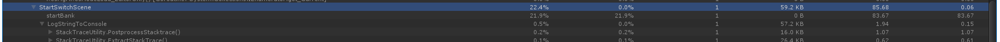

---
title: Unity性能检查
date: 2020-06-08 20:37:12
updated: 2020-06-08 20:37:12
description: 使用 Unity Profile 进行 Unity 项目的性能检查案例
categories: Unity
tags: performance analysis
---
# 测试工具
Unity Profile					

# 测试场景
内城切换至指挥官界面						
						
# 开始测试
- 加入开始标签  startSwitchScene						
- 加入结束标签 SwitchSceneComplete						
## 获得流程帧区间
| Sample | 帧 |
| :--- | :---- |
| StartSwtichScene | 68  |
| SwitchSceneComplete | 71 |

整个流程帧数合计 3 帧  
> 总耗时: 310.62 + 96.62 + 16.53 + 760.59 = 1184.36(ms)

## 新增自定义 Sample
检查代码逻辑，这三帧的操作可以归类为以下情况

- 开始切换
  Sample: StartSwitchScene
- 显示 loading ,加载 UIPackage  
  Sample: ShowLoadUI  
- 离开当前场景  
  Sample: SceneBase.LeaveScene  
  Sample: Lua Call scene hide
- 加载完毕
- 离开场景完毕，清理内存  
  Sample: ClearMemory  
- 进入新场景  
  Sample: SceneBase.EnterScene  
  Sample: Lua Call scene show  
- 场景切换完成  
  Sample: Lua Call scene change  
  Sample: EnterSceneComplete  

## 逐帧分析
### 峰值帧为第 71 帧
详情如下

### 函数耗时排序 TOP 5
| Sample |  Time(ms) |
| :----  | :---- |
| Lua Call Scene Change |  328.17 |
| Loading.ReadObject | 193.53 |
| WaitFrameClearMemory(Coroutine:MoveNext) | 111.43
| StartSwitchScene | 92 |
| GC.Collect | 29.17 |

综合峰值和排序, 得出结论:  
热点数据存在 Lua 响应 Scene Change 事件的调用  
ReadObject 为正常情况，可忽略。 第三条为 Lua 的 GC ，时长可接受
StartSwitchScene 数值有点高，添加更详细的 Sample 发现音频部分加载时长可能存在异常，但是时长还能接受，优先级不高。

						
## 热点分析
待续