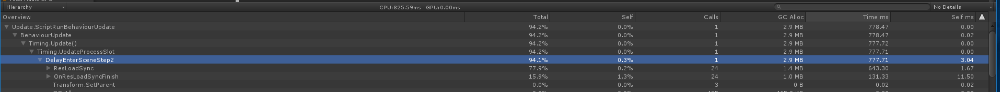
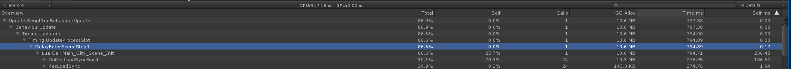
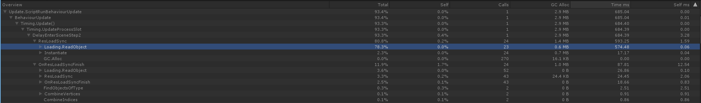

---
title: 场景切换性能分析
date: 2020-06-10 11:05:06
updated: 2020-06-10 11:05:06
description: 一次对场景切换的性能分析
categories: Unity
tags: performance analysis
---

## 测试环境

|工具|平台|加载|
|:--|:--|:--|
|UnityProfile|android|AssetDataBase|

## 游戏表现
从其它场景切换至内城场景时会有 1-2 s 左右的卡顿

## 初步分析
获取切换区间， CPU 消耗详情，检查峰值帧。  
Loading.ReadObject 函数耗时占比过高，初步判断热点问题在于加载。

## 代码检查
查看内城代码，进入场景时会触发 IEnumerator<float>DelayEnterScene() 的流程控制函数。  
针对函数内部流程分别增加采样函数 step1 ~ step 4，并对其中 Lua 部分的调用增加 Lua Call Main_City_Scene_Init 的采样函数

### 结果分析

耗时异常发生在 Step2 以及 step3 结果如下图

结合代码查看：  
- Step2 内城在同步加载场景基础 Obejct
- Step3 模型中的 Collider 创建一些动态创建的建筑。

## 加载分析
增加加载耗时计数，统计场景切换时，每个 res 的加载耗时，结果如下。

总耗时：837.7312(ms)  
Step2 Loading.ReadObject = 574.48  
Step3 Loading.ReadObject = 229.03  

**对比可知。耗时问题在于场景 prefab 的加载。**